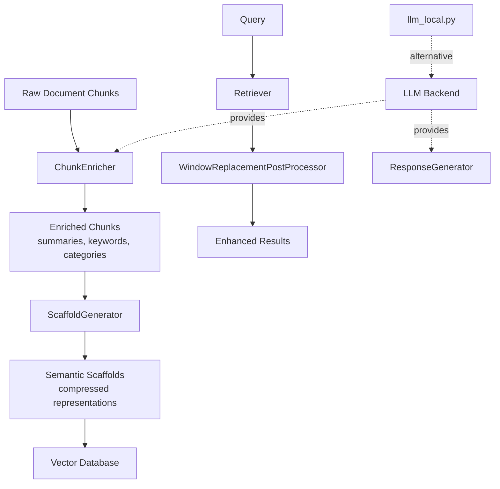

# Processing Module Documentation

## Overview

The `src.cubo.processing` module provides document processing, enrichment, and semantic compression capabilities for the CUBO RAG system. It transforms raw document chunks into enriched, semantically-compressed scaffolds optimized for retrieval.

## Architecture



## Components

### 1. ChunkEnricher (`enrichment.py`)

**Purpose**: Enriches document chunks with LLM-generated metadata to improve retrieval quality.

**Inputs**:
- `chunks: List[str]` - Raw text chunks from documents

**Outputs**:
- `List[Dict]` - Enriched chunks containing:
  - `text`: Original chunk text
  - `summary`: One-sentence summary
  - `keywords`: List of 5 most important keywords
  - `category`: Single category label (e.g., 'Technology', 'Finance')
  - `consistency_score`: Float 0-5 rating quality of summary

**Configuration**:
```python
from src.cubo.processing.enrichment import ChunkEnricher
from src.cubo.processing.generator import ResponseGenerator

# Using Ollama (online)
llm_provider = ResponseGenerator(model="llama3.2:latest")
enricher = ChunkEnricher(llm_provider=llm_provider)

# Using local model (offline)
from src.cubo.processing.llm_local import LocalResponseGenerator
llm_provider = LocalResponseGenerator(model_path="path/to/model.gguf")
enricher = ChunkEnricher(llm_provider=llm_provider)
```

**Integration Points**:
- **Input**: Used by `ScaffoldGenerator` to pre-process chunks
- **Dependencies**: Requires `ResponseGenerator` or `LocalResponseGenerator`
- **Logging**: Uses `src.cubo.utils.logger` for warnings/errors

**Performance Considerations**:
- LLM calls are synchronous - expect ~1-2s per chunk
- Failed enrichments gracefully degrade (empty values, not errors)
- Prompts are optimized for single-sentence responses

---

### 2. ScaffoldGenerator (`scaffold.py`)

**Purpose**: Creates semantically-compressed scaffolds by grouping similar chunks and generating compressed representations.

**Inputs**:
- `chunks_df: pd.DataFrame` - DataFrame with columns:
  - `chunk_id` (or custom `id_column`): Unique identifier
  - `text` (or custom `text_column`): Chunk text
  - Optional: `filename`, `file_hash`, `token_count`

**Outputs**:
- `Dict[str, Any]` containing:
  - `scaffolds_df`: DataFrame with scaffolds
  - `chunk_to_scaffold_mapping`: Dict mapping chunk_id → scaffold_id
  - `scaffold_groups`: List of chunk_id lists per scaffold

**Configuration Parameters**:
```python
from src.cubo.processing.scaffold import ScaffoldGenerator

generator = ScaffoldGenerator(
    enricher=enricher,                    # ChunkEnricher instance
    embedding_generator=embed_gen,        # EmbeddingGenerator instance
    scaffold_size=5,                      # Chunks per scaffold
    similarity_threshold=0.75             # Min similarity for grouping
)
```

**Workflow**:
1. **Enrichment**: Calls `ChunkEnricher` if summaries not present
2. **Grouping**: Groups chunks by semantic similarity
3. **Merging**: Generates scaffold summaries from chunk summaries
4. **Embedding**: Creates embeddings for scaffold text
5. **Persistence**: Saves scaffolds to parquet with manifest

**File Outputs**:
```
output_dir/
├── scaffolds.parquet         # Main scaffold data
├── chunk_mapping.json        # chunk_id → scaffold_id
└── manifest.json            # Run metadata
```

**Integration Points**:
- **Input**: Called by ingestion pipeline
- **Output**: Scaffolds stored in vector database
- **Dependencies**: `ChunkEnricher`, `EmbeddingGenerator`

**Memory/Performance**:
- Memory usage: ~O(n_chunks × embedding_dim)
- Typical: 10K chunks × 384 dims × 4 bytes = ~15MB
- Large docs (100K+ chunks): Consider batching

---

### 3. WindowReplacementPostProcessor (`postprocessor.py`)

**Purpose**: Enhances retrieval results by replacing single-sentence matches with their surrounding context window.

**Inputs**:
- `retrieval_results: List[Dict]` - Results from retriever with structure:
  ```python
  {
      'document': '...',           # Original matched sentence
      'metadata': {
          'window': '...',         # Surrounding context (if available)
          ...
      },
      'score': 0.85
  }
  ```

**Outputs**:
- `List[Dict]` - Enhanced results with `document` replaced by `window` when available

**Configuration**:
```python
from src.cubo.processing.postprocessor import WindowReplacementPostProcessor

processor = WindowReplacementPostProcessor(
    target_metadata_key="window"  # Key in metadata containing window text
)

enhanced_results = processor.postprocess_results(retrieval_results)
```

**Integration Points**:
- **Input**: Used by `Retriever` after initial document retrieval
- **Output**: Enhanced results passed to `Generator`
- **Dependencies**: None (standalone component)

**Use Case**:
Sentence-window retrieval: Match on precise sentences but provide context for generation.

---

### 4. ResponseGenerator (`generator.py`)

**Purpose**: Wrapper around Ollama API for LLM-based generation and enrichment.

**Configuration**:
```python
from src.cubo.processing.generator import ResponseGenerator

generator = ResponseGenerator(
    model="llama3.2:latest",     # Ollama model name
    host="http://localhost:11434" # Ollama server URL
)

response = generator.generate_response(
    query="What is RAG?",
    context="RAG stands for Retrieval Augmented Generation...",
    messages=[]  # Optional conversation history
)
```

**Features**:
- Async generation via `ServiceManager`
- Conversation history support
- Automatic retry on failure
- Structured prompt templates

**Offline Alternative**: See `llm_local.py` below

---

### 5. LocalResponseGenerator (`llm_local.py`)

**Purpose**: Offline LLM generation using `llama_cpp` for environments without internet access.

**Setup**:
1. **Install llama-cpp-python**:
   ```bash
   pip install llama-cpp-python
   ```

2. **Download a GGUF model** (e.g., from Hugging Face):
   ```bash
   # Example: Llama 3.2 3B Instruct
   wget https://huggingface.co/TheBloke/Llama-2-7B-GGUF/resolve/main/llama-2-7b.Q4_K_M.gguf
   ```

3. **Configure in `config.json`**:
   ```json
   {
       "local_llama_model_path": "path/to/llama-2-7b.Q4_K_M.gguf"
   }
   ```

4. **Use in code**:
   ```python
   from src.cubo.processing.llm_local import LocalResponseGenerator

   llm = LocalResponseGenerator()
   response = llm.generate_response(
       query="What is this about?",
       context="Document text..."
   )
   ```

**Switching Between Online/Offline**:

```python
# In your application initialization:
from src.cubo.config import config

if config.get('offline_mode', False):
    from src.cubo.processing.llm_local import LocalResponseGenerator
    llm_provider = LocalResponseGenerator()
else:
    from src.cubo.processing.generator import ResponseGenerator
    llm_provider = ResponseGenerator()

enricher = ChunkEnricher(llm_provider=llm_provider)
```

**Performance**:
- Slower than Ollama on GPU
- Expect ~2-5s per response on CPU
- Memory: ~4GB for 7B Q4 model

**Robustness**:
- Handles missing dependencies gracefully
- Falls back to error if model path not configured
- Supports multiple `llama_cpp` API versions

---

## Configuration Flags

### Global Config (`src/cubo/config.py`)

```json
{
    "offline_mode": true,
    "local_llama_model_path": "models/llama-2-7b.Q4_K_M.gguf",
    "scaffold_size": 5,
    "similarity_threshold": 0.75,
    "llm_model": "llama3.2:latest",
    "embedding_model": "BAAI/bge-small-en-v1.5"
}
```

### Environment Variables

```bash
# Force offline mode
export CUBO_OFFLINE=1

# Custom model path
export CUBO_LOCAL_MODEL_PATH=/path/to/model.gguf

# Ollama host (for online mode)
export OLLAMA_HOST=http://localhost:11434
```

---

## Testing

### Unit Tests

Located in `tests/processing/`:
- `test_enrichment.py`: ChunkEnricher prompt testing, output parsing
- `test_scaffold_persist.py`: Scaffold save/load, format validation
- `test_create_scaffolds_parquet.py`: End-to-end scaffold creation

### Running Tests

```bash
# All processing tests
pytest tests/processing/ -v

# Specific component
pytest tests/processing/test_enrichment.py -v

# With coverage
pytest tests/processing/ --cov=src.cubo.processing --cov-report=html
```

### Performance Tests

See `tests/performance/test_scaffold_memory.py` for:
- Memory profiling with large documents
- Batch processing benchmarks
- Streaming chunk tests

---

## Common Workflows

### 1. Basic Document Processing

```python
from src.cubo.processing.enrichment import ChunkEnricher
from src.cubo.processing.generator import ResponseGenerator

# Setup
llm_provider = ResponseGenerator()
enricher = ChunkEnricher(llm_provider)

# Process chunks
chunks = ["First chunk...", "Second chunk..."]
enriched = enricher.enrich_chunks(chunks)

# Each enriched chunk contains:
# - text, summary, keywords, category, consistency_score
```

### 2. Scaffold Generation

```python
import pandas as pd
from src.cubo.processing.scaffold import ScaffoldGenerator

# Prepare data
chunks_df = pd.DataFrame({
    'chunk_id': ['c1', 'c2', 'c3'],
    'text': ['...', '...', '...']
})

# Generate scaffolds
generator = ScaffoldGenerator(enricher=enricher)
result = generator.generate_scaffolds(chunks_df)

# Save for persistence
from pathlib import Path
generator.save_scaffolds(result, Path('data/scaffolds'))
```

### 3. Retrieval Postprocessing

```python
from src.cubo.processing.postprocessor import WindowReplacementPostProcessor

processor = WindowReplacementPostProcessor()

# Enhance retrieval results
results = retriever.retrieve(query="What is RAG?", top_k=5)
enhanced_results = processor.postprocess_results(results)

# Pass to generator
answer = generator.generate(query, enhanced_results)
```

---

## Troubleshooting

### Issue: "No local Llama model path configured"

**Solution**: Set `local_llama_model_path` in `config.json` or use `CUBO_LOCAL_MODEL_PATH` env var.

### Issue: Enrichment is slow

**Causes**:
- LLM backend is slow (CPU-only)
- Large chunk size

**Solutions**:
- Use smaller model (3B instead of 7B)
- Reduce chunk size in document splitting
- Use GPU acceleration for Ollama/llama_cpp

### Issue: Out of memory during scaffold generation

**Solution**: Process in batches:
```python
# Instead of:
result = generator.generate_scaffolds(all_chunks_df)

# Do:
batch_size = 1000
for i in range(0, len(all_chunks_df), batch_size):
    batch = all_chunks_df.iloc[i:i+batch_size]
    result = generator.generate_scaffolds(batch)
    # Save/process incrementally
```

---

## Future Enhancements

1. **Streaming Processing**: Support for very large documents (>1M chunks)
2. **Async Enrichment**: Parallel LLM calls for faster processing
3. **Custom Prompts**: User-configurable enrichment prompts
4. **Quality Metrics**: Automated evaluation of enrichment quality
5. **Incremental Updates**: Add new chunks without reprocessing all scaffolds

---

## References

- **Sentence-Window Retrieval**: [LlamaIndex Documentation](https://docs.llamaindex.ai/en/stable/)
- **llama.cpp**: [GitHub Repository](https://github.com/ggerganov/llama.cpp)
- **GGUF Models**: [Hugging Face Collections](https://huggingface.co/models?library=gguf)
