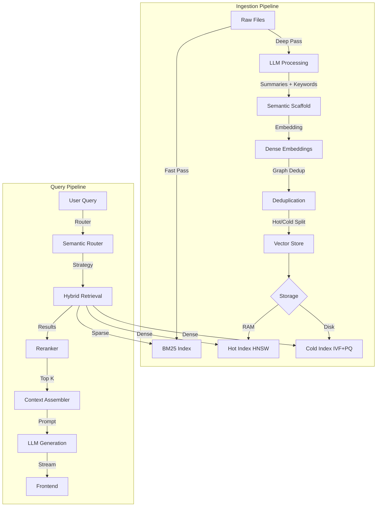

# CUBO - AI Document Assistant v1.3.0

**Note (2025-12-17):** Documentation cleanup — aligned versioning, fixed `src`→`cubo` examples, removed duplicate Dependencies section, and updated pytest coverage flags.

🌍 **English** | **[Italiano](README.it.md)** | **[中文](README.zh.md)

[](https://github.com/your-username/cubo/actions/workflows/ci-cd.yml)
[](https://github.com/your-username/cubo/actions/workflows/e2e.yml)

A modular Retrieval-Augmented Generation system using embedding models and Large Language Models (LLMs) with a modern desktop interface and web API.

## What's New in v1.3.0

- **🌐 Web API & Frontend**: FastAPI backend with Next.js frontend for web-based document management
- **🔍 Request Tracing**: Trace ID propagation across all API requests for debugging and monitoring
- **🔒 Query Scrubbing**: Automatic query sanitization in logs for privacy protection
- **🇪🇺 GDPR Compliance**: Document deletion, audit log export, and citation tracking for EU compliance- 🧹 Background Compaction for Deletion: `DELETE /api/documents` now enqueues a background compaction job to physically purge vectors from FAISS; use `?force=true` to request priority compaction (admin).- **🧪 E2E Testing**: Automated end-to-end smoke tests with CI/CD integration
- **📊 Structured Logging**: JSON-formatted logs with trace ID indexing for easy searching
- **🚀 Full Stack**: Complete integration from upload → ingest → index → query

## What's New in v1.2.0

- **Optional Enhanced Processing**: Support for external vision-language models (e.g., Dolphin) to improve PDF/image parsing; disabled by default and opt-in.
- **Seamless User Experience**: System provides sensible defaults and will only use optional components when explicitly configured.
- **Improved Document Understanding**: Better semantic embeddings with EmbeddingGemma-300M integration
- **Enterprise-Ready**: Production-ready document processing without user configuration complexity

## Changelog

### v1.3.0 (November 2024)

- 🌐 **Web API Server**: Added FastAPI backend with RESTful endpoints for upload, ingest, build, and query
- 🎨 **Next.js Frontend**: Modern React frontend with shadcn/ui components for document management
- 🔍 **Request Tracing**: Trace ID propagation with `x-trace-id` headers across all API requests
- 🔒 **Query Scrubbing**: Automatic query hashing in logs when privacy mode enabled
- 📊 **Structured Logging**: JSON-formatted logs with trace ID support for debugging
- 🧪 **E2E Testing**: Complete smoke test suite validating upload → ingest → build → query flow
- 🔧 **CI/CD**: GitHub Actions workflow for automated E2E testing with log verification
- 📚 **API Documentation**: Interactive OpenAPI docs at `/docs` endpoint

### v1.2.0 (September 2024)

- 🐬 **Optional Dolphin Support**: Added support for ByteDance/Dolphin as an optional external vision-language model for advanced PDF/image parsing (opt-in).
- ⚡ **Optional Enhanced Processing**: The system can use external vision-language models (e.g., Dolphin) when explicitly enabled; this behavior is not automatic by default.
- 🧠 **EmbeddingGemma Integration**: Seamless integration with EmbeddingGemma-300M for high-quality semantic embeddings
- 🎯 **User Experience**: Sensible defaults reduce configuration; optional components require explicit opt-in.
- 🔧 **Architecture**: Enhanced document processor combining vision parsing with semantic embeddings
- 📄 **Document Support**: Improved handling of PDFs, images, and complex documents with automatic fallback

### v1.1.0 (September 2025)

- ✨ **Sentence Window Retrieval**: Implemented advanced chunking with configurable context windows for better retrieval quality
- 🖥️ **Desktop GUI**: Added modern PySide6-based interface with drag-and-drop document upload
- ⚡ **Enhanced Responsiveness**: Optimized backend initialization to prevent GUI freezing during document processing
- 🎨 **UI Improvements**: Lightened drag-and-drop area styling and added progress indicators
- 🔧 **Architecture**: Added postprocessor module for enhanced retrieval with WindowReplacementPostProcessor and LocalReranker
- 🐛 **Bug Fixes**: Resolved circular import issues and improved error handling

## Getting Started — Two commands (super simple)

For unskilled users we provide two single commands that cover the most common workflows.

- Full-stack (one-click, Windows):

```powershell
# from repo root
.\run_local.ps1
# (or double-click `start.bat`)
```
This will create a virtual environment, install necessary dependencies (backend + frontend), and start the full stack (backend + frontend).

- One-line clone + run (cross-platform):

```bash
# Clone the repo and run the local quickstart
git clone https://github.com/your-username/cubo.git && cd cubo && ./run_local.sh
```

- Install a compact runtime (recommended for demos / low-resource machines):

```bash
python -m pip install -e .[minimal]
```

- Install the full runtime with all features:

```bash
python -m pip install -e .[full]
```

- Install as a library and run only the API (cross-platform):

```bash
python -m pip install -e . && python -m cubo.server.run --reload
```

Optional: to start the frontend UI in a second terminal:

```bash
npm run dev --prefix frontend
```

> Note: `run_local.ps1` and `run_local.sh` are provided for Windows and macOS/Linux respectively to make the full-stack start safe and idempotent. For an automated clone+run helper, see `tools/quickstart.sh` and `tools/quickstart.ps1`.

Choose the installation method that matches your needs (advanced instructions below):

### Developer Library
**Goal:** Integration. "I want to add RAG to my Python script."

```bash
pip install cubo
```

Usage:
```python
from cubo import CuboCore

# Initialize RAG system
rag = CuboCore()
rag.initialize_components()

# Query your documents
response = rag.query("What is the invoice total?")
print(response)
```

### Docker User
**Goal:** Enterprise/Server Deployment. "I want to host this on my server."

```bash
docker-compose up --build
```
The system will be available at `http://localhost:3000`.

## Installation Options

CUBO uses **optional extras** to minimize install size. Choose what you need:

| Command | What You Get | Size |
|---------|--------------|------|
| `pip install cubo` | CLI client, document parsing, logging | ~50MB |
| `pip install cubo[embeddings]` | + PyTorch, sentence-transformers | ~2.5GB |
| `pip install cubo[server]` | + FastAPI, uvicorn | ~10MB |
| `pip install cubo[ollama]` | + Ollama client | ~5MB |
| `pip install cubo[ocr]` | + Tesseract OCR support | ~20MB |
| `pip install cubo[faiss]` | + FAISS vector store | ~50MB |
| `pip install cubo[full]` | **Everything above** (recommended) | ~3GB |
| `pip install cubo[all]` | Full + GUI + dev tools | ~3.5GB |

### Examples

```bash
# Minimal: just document parsing (no ML)
pip install cubo

# API development: server + embeddings
pip install cubo[embeddings,server]

# Full RAG system with all features
pip install cubo[full]

# Development environment
pip install cubo[all]
```

> **Note:** If upgrading from an older version where `pip install cubo` installed everything,
> you now need `pip install cubo[full]` to get the same behavior.

### For Quick Development / CI

For fast iteration and PR checks, use minimal dependencies to reduce install time:

```bash
pip install -e "."  # Core only
```


## Testing

Run tests with the `PYTHONPATH` set to the repo root:

PowerShell (Windows):

 ```pwsh
 $env:PYTHONPATH = "${PWD}"; pytest -q
 ```

 macOS / Linux (bash/zsh):

 ```bash
 export PYTHONPATH="${PWD}"; pytest -q
 ```

 If you have FAISS-dependent tests (dense retrieval tests), ensure FAISS is installed. FAISS has platform-specific packages; pick one of these depending on your environment:

 Linux / macOS (pip):

 ```bash
 pip install faiss-cpu
 # or for GPU builds (if available):
 pip install faiss-gpu
 ```

 Windows (recommended: conda or miniforge):

 ```pwsh
 conda create -n cubo-env python=3.11
 conda activate cubo-env
 conda install -c conda-forge faiss-cpu
 ```

 If FAISS installation is not desired on your platform, tests that rely on FAISS will be skipped if FAISS is not present. See `tests/conftest.py` for the skip logic.

CI note: The repository's CI runs a Linux job that installs `faiss-cpu` and runs the FAISS-dependent indexing tests. This ensures indexing behavior is validated on a supported Linux FAISS build.
- 🤖 **Ollama Integration**: Local LLM generation with configurable models
- 🛡️ **Security Features**: Path sanitization, file size limits, and rate limiting
- 📊 **Comprehensive Logging**: Detailed logging with configurable levels
- ⚙️ **Configuration Management**: JSON-based configuration with environment variable overrides
- 🧪 **Testing Framework**: Unit tests with pytest and CI/CD pipeline

## Features

- **Modular Architecture**: Clean separation of concerns with dedicated modules
- **🚀 Laptop Mode**: Automatic resource optimization for laptops with limited RAM/CPU. Auto-detects system resources and applies memory-efficient settings. See [docs/LAPTOP_MODE.md](docs/LAPTOP_MODE.md) for details.
- **Semantic Deduplication**: Built-in hybrid deduplication pipeline to reduce duplicate chunks across datasets (MinHash + FAISS + HDBSCAN). See `docs/deduplication.md` for usage and examples.
- **Multi-format Support**: Supports .txt, .docx, .pdf, and .md files
- **Sentence Window Chunking**: Intelligent text chunking with configurable context windows for better retrieval
- **Desktop GUI**: Modern PySide6-based interface with drag-and-drop functionality
- **Enhanced Document Processing**: Optional integration with vision-language models (e.g., Dolphin) for superior PDF/image parsing when configured (disabled by default).
- **Dual Retrieval System**: Sentence window + auto-merging retrieval with automatic method selection
- **Device Auto-detection**: Automatically uses GPU (CUDA) if available, falls back to CPU
- **Security Features**: Path sanitization, file size limits, and rate limiting
- **Comprehensive Logging**: Detailed logging with configurable levels
- **Interactive & CLI Modes**: Both interactive conversation and command-line interfaces

## System Architecture

The following diagram illustrates the high-level architecture of CUBO's ingestion and query pipelines, highlighting the hybrid retrieval and hot/cold storage mechanisms.



### Deep Ingestor

The `DeepIngestor` adds a background deep-processing path to the ingestion pipeline. It generates deterministic, reproducible chunks and writes them to `chunks_deep.parquet` for downstream processing like embedding and retrieval.

Key behavior:
- Supports `.txt`, `.docx`, `.pdf`, `.csv`, and `.xlsx` files.
- Produces `chunk_id` using the file-content hash by default; this can be toggled via `deep_chunk_id_use_file_hash` in `config.json`.
- CSV chunking can be configured via `deep_csv_rows_per_chunk`.
- Outputs are written atomically as parquet (`chunks_deep.parquet`) and an `ingestion_manifest.json`.

Run the CLI script to start deep ingestion:

```pwsh
python tools/deep_ingest.py --input data/docs --output data/deep
```

To run fast-pass ingestion then deep ingestion in one command:

```pwsh
python tools/fast_pass_ingest.py data/docs --output data/fastpass --deep
```

### Two-Phase Ingestion (Fast + Deep)

You can use the `IngestionManager` to orchestrate a fast-pass ingestion immediately followed by a background deep ingestion.

Run fast pass and trigger deep ingestion in the background:

```pwsh
python tools/fast_pass_ingest.py data/docs --output data/fastpass --background
```

Or start the ingestion service which polls for completed fast passes and triggers deep ingestion automatically:

```pwsh
python tools/ingestion_service.py --interval 10
```

The ingestion service uses the SQLite `metadata_db` to track run status.

### BM25 Backend & Migration (Python)

We provide a plugin interface for BM25 that supports multiple backends. By default the Python backend is used for indexing and querying. There are helper utilities to convert and export BM25 indexing data as JSON for compatibility with other tooling.

Configuration example (in `config.json`):

```json
   "bm25": {
      "backend": "python",
      "preserve_bm25_stats_json": true
   }
```

Migration helpers are provided to convert NDJSON/JSONL chunks into a simple BM25 representation and to export it back to JSON:

Convert chunks to a BM25 representation:
```pwsh
python -c "from cubo.retrieval.bm25_migration import convert_json_stats_to_bm25; convert_json_stats_to_bm25('data/bm25_stats.json', 'data/fastpass/chunks.jsonl', 'data/bm25_dir')"
```

Export a BM25 representation to JSON lines for compatibility:
```pwsh
python -c "from cubo.retrieval.bm25_migration import export_bm25_to_json; export_bm25_to_json('data/bm25_dir', 'data/fastpass/chunks_from_bm25.jsonl')"
```

Note: The `FastPassIngestor` takes `bm25.backend` from `config.json` and will attempt to build the configured backend during fast-pass ingestion; if you prefer to keep JSON stats (compatibility), set `bm25.preserve_bm25_stats_json` to true.


### Semantic Query Router

We added a `SemanticRouter` module to classify query types and route retrieval strategies automatically. The router uses heuristic patterns and configuration options to determine which retrieval weights and candidate counts to use.

Configure routing in `config.json` (defaults are shown below):

```json
   "routing": {
      "enable": true,
      "factual_bm25_weight": 0.6,
      "conceptual_dense_weight": 0.8
   }
```

The router produces a strategy with keys such as `bm25_weight`, `dense_weight`, `k_candidates`, and `use_reranker`, which are fed into the retriever automatically.

### Hot/Cold FAISS Index & Promotions

We now implement a hot/cold FAISS index via `FAISSIndexManager` and the `FaissStore` wrapper. This uses an HNSW index in-memory for the "hot" portion and an IVF+PQ index on-disk for the "cold" portion. The `vector_index.hot_ratio` configuration controls the proportion of vectors kept in memory for hot index.

If a document is frequently accessed (access count exceeds `vector_index.promote_threshold`), it is promoted into the hot set automatically by rebuilding the FAISS indexes with that id included in the hot slice. Note: this is a simple promotion mechanism that rebuilds indexes and works well for low-volume promotion scenarios.

Configuration example:

```json
   "vector_index": {
      "hot_ratio": 0.2,
      "promote_threshold": 10,
      "nlist": 4096,
      "pq_m": 64
   }
```

### Reranker (Cross-Encoder fallback)

The retriever now supports a CrossEncoder reranker if you specify a `retrieval.reranker_model` in `config.json`. If CrossEncoder isn’t available, a `LocalReranker` will be used as a fallback which scores with cosine similarity between query and document embeddings.

To enable:

```json
   "retrieval": {
      "use_reranker": true,
      "reranker_model": "cross-encoder/ms-marco-MiniLM-L-6-v2"
   }
```

When enabled, reranking runs on the top candidate set from the router strategy and reorders them by the cross-encoder score.

How it integrates with retrievers
--------------------------------

- The `FaissHybridRetriever` has an optional `reranker` constructor parameter. Pass an instantiated reranker (e.g., a CrossEncoder implementation) to have the retriever apply re-ranking to the top candidates when requested by the query `strategy`.
- The retriever will consult the `strategy['use_reranker']` flag provided by the `SemanticRouter` (or by caller) to decide whether to invoke the `reranker` for a given query. If `use_reranker` is `True` and a `reranker` is available, it will be applied to re-score and reorder the candidate documents.
- Reranker contract: the object should implement `rerank(query, candidates, max_results=None)` and return a list of candidates, optionally carrying a `rerank_score` or `doc_id` to allow mapping back to original documents.
- If the reranker raises an exception or returns an empty result, the retriever falls back to the fused BM25+FAISS ordering.

Example (programmatic):

```python
from cubo.retrieval.retriever import FaissHybridRetriever
from cubo.rerank.reranker import CrossEncoderReranker

reranker = CrossEncoderReranker(model_name='cross-encoder/ms-marco-MiniLM-L-6-v2')
hybrid = FaissHybridRetriever(bm25, faiss_manager, embedding_generator, documents=docs, reranker=reranker)
strategy = {'use_reranker': True}
results = hybrid.search('What is apple', top_k=5, strategy=strategy)
```


CI & Testing Notes
- `pyarrow` and `openpyxl` are required to write/read parquet and xlsx files. See `requirements.txt`.
- Add `reportlab` to `requirements/requirements-dev.txt` for PDF creation during tests (or use the `dev` extra via `pip install -e .[dev]`).
- Run tests with the `PYTHONPATH` set to the repo root:

```pwsh
$env:PYTHONPATH = "${PWD}"; pytest -q
```
Logging & offline search
------------------------

- The project supports offline structured logging and an offline searchable index. To enable structured JSON logging, edit `config.json` and set `logging.format` to `json` and specify `logging.log_file`.
- Use `tools/log_indexer.py` to build a local SQLite FTS index of logs for quick search:

```pwsh
python tools/log_indexer.py --log-file ./logs/cubo_log.jsonl --db ./logs/index/logs.db
```

- Search the index with `tools/logcli.py`:

```pwsh
python tools/logcli.py --db ./logs/index/logs.db --query "error" --limit 20
```

- By default logs are stored in `./logs/cubo_log.jsonl` and the index is at `./logs/index/logs.db`.


Testing markers & CI notes
-------------------------

- Use `pytest` markers to control environment-specific tests:
   - `requires_faiss`: Mark tests that require FAISS (dense retrieval) – CI will run these on a Linux runner with `faiss-cpu` installed.
   - `requires_whoosh` (deprecated): This marker used to identify Whoosh-dependent tests. Whoosh backend has been removed, and Python BM25 backend is the default.
   - `integration` / `e2e`: Longer-running tests that exercise higher-level system behavior and are suitable for dedicated CI runners.

- The CI pipeline has a `faiss_e2e` job that runs FAISS-dependent end-to-end tests (including a concurrent publisher/reader stress test) on `ubuntu-latest` with `faiss-cpu` installed.


## Project Structure

```
cubo/
├── cubo/                    # Package source
│   ├── __init__.py        # Package initialization
│   ├── config.py          # Configuration management
│   ├── logger.py          # Logging setup
│   ├── model_loader.py    # Model loading and device management
│   ├── document_loader.py # Document loading and processing
│   ├── retriever.py       # Document retrieval logic
│   ├── generator.py       # Response generation
│   ├── utils.py           # Utility functions with sentence window chunking
│   ├── postprocessor.py   # Postprocessing for enhanced retrieval
│   └── main.py           # Main entry point
├── gui/                   # Desktop GUI application
│   ├── __init__.py       # GUI package initialization
│   ├── main_window.py    # Main application window
│   ├── components.py     # Reusable UI components
│   └── README.md         # GUI documentation
├── data/                  # Document storage
├── models/                # Model storage
├── logs/                  # Log files
├── config.json           # Configuration file
├── main.py              # CLI entry point
├── launch_gui.py        # GUI launcher
├── requirements.txt      # Python runtime dependencies
├── requirements/requirements-dev.txt # Development dependencies (preferred: `pip install -e .[dev]`)
└── README.md            # This file
```

## Detailed Installation Guide

### Prerequisites

- **Python 3.8+**: Download from [python.org](https://python.org)
- **Ollama**: Install from [ollama.ai](https://ollama.ai) and pull a model:
  ```bash
  ollama pull llama3.2:latest
  ```
- **Git** (optional): For cloning the repository

### Step-by-Step Installation

1. **Download CUBO**:

   ```bash
   git clone https://github.com/your-repo/cubo.git
   cd cubo
   ```

2. **Create Virtual Environment**:

   ```bash
   python -m venv .venv
   # Activate (Windows)
   .venv\Scripts\activate
   # Activate (Linux/Mac)
   source .venv/bin/activate
   ```

3. **Install Dependencies**:

   ```bash
   pip install -r requirements.txt
   ```

4. **Configure**:

   - Edit `config.json` for your settings
   - Place documents in `data/` folder
   - Ensure model files are in `models/` folder

5. **Run Setup Wizard**:

   ```bash
   python -m cubo.main
   ```

   Follow the prompts to verify paths and models.

6. **Optional: Enable Enhanced Document Processing** (Dolphin):

   For superior PDF and image processing, download ByteDance/Dolphin (automatically used when available):

   ```bash
   # Download the 400MB Dolphin model
   python download_dolphin.py --download

   # Test the installation
   python download_dolphin.py --test

   # Enable in config.json (set "dolphin.enabled": true)
   # The system will automatically use enhanced processing when Dolphin is available
   ```

   ```

   ```

### Offline Installation

For air-gapped environments:

- Download all dependencies on an internet-connected machine
- Use `pip download -r requirements.txt -d packages/`
- Transfer to target machine and `pip install --no-index --find-links=packages/ -r requirements.txt`

## Configuration

Edit `config.json` to customize:

- `model_path`: Path to your embedding model
- `llm_model`: Ollama model name (e.g., "llama3.2:latest")
- `top_k`: Number of documents to retrieve
- `chunk_size`: Size of text chunks
- `max_file_size_mb`: Maximum file size limit
- `log_level`: Logging level (DEBUG, INFO, WARNING, ERROR)

### Laptop Mode

CUBO automatically detects laptop hardware (≤16GB RAM or ≤6 CPU cores) and enables optimizations:

```bash
# Environment variable override
export CUBO_LAPTOP_MODE=1  # Force enable
export CUBO_LAPTOP_MODE=0  # Force disable

# CLI flags
python start_api_server.py --mode laptop      # Force enable laptop-optimized mode
python start_api_server.py --mode default     # Force disable laptop-optimized mode

# Full stack start script
python tools/start_fullstack.py --mode laptop --config-path configs/config_local.json
You can add `--force-kill` to attempt to terminate any processes already listening on the chosen ports:

```powershell
python tools/start_fullstack.py --mode laptop --config-path configs/config_local.json --force-kill
```
```

See [docs/LAPTOP_MODE.md](docs/LAPTOP_MODE.md) for full configuration options.

### Environment Variables

For security and flexibility, sensitive configuration can be overridden via environment variables:

- `CUBO_ENCRYPTION_KEY`: 32-byte key for data encryption (base64 encoded)
- `CUBO_MODEL_PATH`: Override model path
- `CUBO_LLM_MODEL`: Override LLM model name
- `CUBO_LAPTOP_MODE`: Enable/disable laptop mode (1/0)

Example:

```bash
export CUBO_ENCRYPTION_KEY="your-32-byte-key-here"
export CUBO_MODEL_PATH="/secure/path/to/model"
```

## Usage

### Desktop GUI Mode (Recommended)

Launch the modern desktop interface:

```bash
python launch_gui.py
```

**GUI Features:**

- Drag and drop documents for instant upload
- Real-time chat interface for asking questions
- Progress indicators during document processing
- Source attribution for transparent answers
- Document management with upload/remove capabilities

### Interactive CLI Mode

```bash
python -m cubo.main
```

### Command Line Mode

```bash
python -m cubo.main --data_folder ./data --query "Your question here"
```

### From Python

```python
from cubo.main import CUBOApp

# Initialize app
app = CUBOApp()

# Load documents
app.doc_loader.load_documents_from_folder("./data")

# Add to retriever
app.retriever.add_documents(documents)

# Query
results = app.retriever.retrieve_top_documents("your query")
response = app.generator.generate_response("your query", "\n".join(results))
```

## API Documentation

### Core Classes

#### `CUBOApp`

Main application class handling the full RAG pipeline.

- `setup_wizard()`: Interactive setup for configuration
- `initialize_components()`: Load models and initialize components
- `interactive_mode()`: Run interactive chat interface
- `command_line_mode(args)`: Process single query from CLI

#### `DocumentRetriever`

Handles vector-based document retrieval.

- `__init__(model)`: Initialize with embedding model
- `add_documents(documents)`: Add documents to vector DB
- `retrieve_top_documents(query, top_k=None)`: Retrieve relevant documents

#### `ResponseGenerator`

Generates responses using Ollama LLM.

- `initialize_conversation()`: Start new conversation
- `generate_response(query, context)`: Generate response with context

#### `DocumentLoader`

Loads and processes documents.

- `load_single_document(file_path)`: Load one document
- `load_documents_from_folder(folder_path)`: Load all documents in folder

#### `Utils`

Static utility functions.

- `sanitize_path(path, base_dir)`: Secure path validation
- `validate_file_size(file_path, max_mb)`: Check file size
- `chunk_text(text, chunk_size, overlap)`: Split text into chunks

#### `Config`

Configuration management.

- `get(key, default=None)`: Get config value
- `set(key, value)`: Set config value
- `save()`: Save to file

## Enterprise Use Cases

CUBO is designed for privacy-conscious organizations needing secure, offline AI assistance. Here are key enterprise applications:

### Legal & Compliance

- **Contract Analysis**: Upload legal documents and query for clauses, obligations, or risks
- **Regulatory Compliance**: Search through compliance manuals and policies
- **Due Diligence**: Analyze financial reports and legal filings

### Healthcare & Research

- **Medical Records**: Secure querying of patient data (with proper HIPAA compliance)
- **Research Papers**: Literature review and hypothesis generation
- **Clinical Guidelines**: Access to treatment protocols and drug information

### Technical Documentation

- **Knowledge Base**: Internal documentation search for support teams
- **API Documentation**: Code and API reference lookup
- **Troubleshooting**: System logs and error code analysis

### Education & Training

- **Course Materials**: Student access to lecture notes and textbooks
- **Training Manuals**: Interactive learning with document Q&A
- **Research Assistance**: Academic paper analysis and summarization

### Business Intelligence

- **Report Analysis**: Financial reports, market research, and competitor analysis
- **Policy Documents**: HR policies, procedures, and compliance documents
- **Meeting Notes**: Search through meeting transcripts and action items

### Key Enterprise Benefits

- **Data Privacy**: 100% offline operation - no data leaves your network
- **User-Friendly Interface**: Desktop GUI makes AI assistance accessible to non-technical users
- **Cost Effective**: One-time purchase vs. ongoing cloud API costs
- **Customizable**: Modular architecture allows enterprise-specific modifications
- **Scalable**: Handles large document collections with efficient vector search
- **Auditable**: Comprehensive logging for compliance and monitoring
- **Responsive**: Optimized performance with sentence window retrieval for better accuracy

## Requirements

- Python 3.8+
- Ollama (for LLM generation)
- CUDA-compatible GPU (optional, for GPU acceleration)
- PySide6 (for GUI interface)

### Dependencies

**Core Dependencies:**

- `sentence-transformers`: For document embedding and semantic search
- `torch`: PyTorch for model inference
- `transformers`: Hugging Face transformers for model loading
- `ollama`: Python client for Ollama LLM API
- `faiss` (preferred): Local vector index for document storage and retrieval (FAISS)
- `tokenizers`: Fast tokenization for text processing

**Document Processing:**

- `python-docx`: Microsoft Word document support
- `pypdf`: PDF document processing

**GUI Interface:**

- `PySide6`: Qt6-based desktop application framework

**Security & Utilities:**

- `cryptography`: Data encryption and security
- `colorama`: Cross-platform colored terminal output
- `psutil`: System monitoring and resource management
- `numpy`: Numerical computing for similarity calculations

**Security & Utilities:**

- `cryptography`: Data encryption and security
- `colorama`: Cross-platform colored terminal output
- `psutil`: System monitoring and resource management
- `numpy`: Numerical computing for similarity calculations

## Troubleshooting

### TensorFlow Warnings

You may see TensorFlow-related warnings during startup. These are harmless and can be suppressed by setting environment variables:

```bash
# Suppress TensorFlow warnings
export TF_CPP_MIN_LOG_LEVEL=2
export TF_ENABLE_ONEDNN_OPTS=0
```

On Windows:

```cmd
set TF_CPP_MIN_LOG_LEVEL=2
set TF_ENABLE_ONEDNN_OPTS=0
```

### Virtual Environment

Always use a virtual environment to avoid dependency conflicts. The project is designed for isolated installation.

## Security Features

- **Path Sanitization**: Prevents directory traversal attacks
- **File Size Limits**: Configurable maximum file sizes
- **Rate Limiting**: Prevents abuse with configurable delays
- **Input Validation**: Comprehensive input validation and sanitization
- **Encryption**: Sensitive data encryption using Fernet
- **Audit Logging**: Security-relevant actions are logged for compliance
- **Environment Variables**: No hardcoded secrets; all sensitive config via env vars
- **Secure Token Generation**: For session management or API keys

## Logging

Logs are stored in `logs/rag_log.txt` with configurable levels. Check logs for debugging and monitoring.

## Testing

CUBO includes comprehensive unit tests to ensure reliability.

### Running Tests

```bash
# Install test dependencies (included in requirements-dev.txt)
pip install -r requirements.txt
pip install -r requirements/requirements-dev.txt

# Or, preferred for development: pip install -e .[dev]

# Run all tests
python -m pytest tests/

# Run specific test file
python -m pytest tests/test_retriever.py -v

# Run with coverage
python -m pytest tests/ --cov=cubo --cov-report=html
```

### CI/CD

CUBO uses GitHub Actions for continuous integration:

- **Automated Testing**: Runs on every push/PR to main/master
- **Linting**: Code quality checks with flake8
- **Build**: Automatic exe generation on main branch pushes
- **Artifacts**: Download built exe from Actions tab

Status: 

### Test Coverage

- **Retriever**: Vector search, caching, similarity thresholds
- **Utils**: Path validation, text processing, file handling
- **Config**: Configuration loading, saving, validation
- **Integration**: End-to-end RAG pipeline testing
